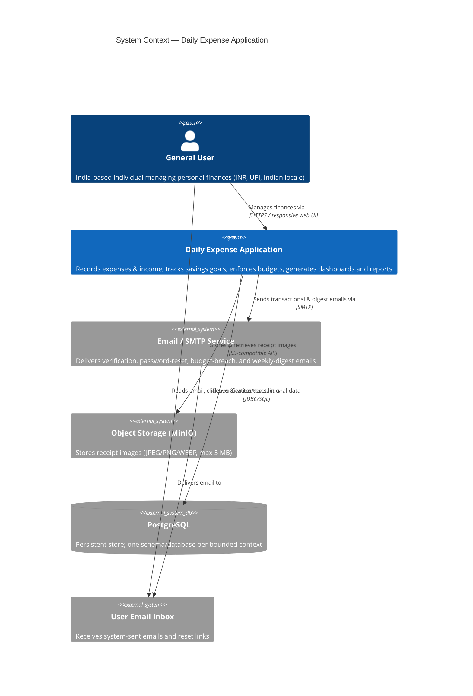

# Context Specification — Daily Expense Application

| Field | Value |
|-------|-------|
| **Document** | 01 — Context Specification (C4 Level 1) |
| **Feature** | Daily Expense Application |
| **Feature Directory** | `specs/001-daily-expense-tracker` |
| **Status** | Draft |
| **Created** | 2026-06-25 |
| **Author Role** | Principal Solutions Architect |
| **Source Inputs** | `Daily expense tracker Requirements - updated.md`, `.specify/memory/constitution.md` (v1.1.1) |
| **Governing Authority** | [Daily Expense Application — Engineering Constitution](../../.specify/memory/constitution.md) |

> **Scope discipline.** This document defines only the system context and external
> boundaries implied by the referenced requirements. No capability, actor, or integration
> beyond those stated in the requirements or mandated by the constitution has been introduced.

---

## 1. System Purpose

### 1.1 Executive Summary

The **Daily Expense Application** is a personal finance management system that enables an
individual user in **India** to record, organise, and analyse their day-to-day money flows.
It captures expenses and income, organises them under categories and tags, tracks progress
toward savings goals, enforces budgets, and surfaces insight through a dashboard and
downloadable reports.

The application is built for the Indian market: it operates in **INR currency**, honours
**Indian locale settings and date formats**, and supports **Indian payment methods including
UPI**, alongside Cash, Credit Card, Debit Card, Net Banking, and Other.

### 1.2 Primary Value Delivered

| # | Capability Area | User Outcome |
|---|-----------------|--------------|
| 1 | Expense & Income Tracking | Record, view, edit, and categorise all money in and out, including recurring entries. |
| 2 | Savings Goals | Set targets and track contributions, progress, and projected completion. |
| 3 | Budgets | Set weekly/monthly budgets with proactive 80% and over-budget alerts. |
| 4 | Categories & Tags | Organise transactions with default and custom categories and cross-cutting tags. |
| 5 | Receipts | Attach, view, download, and remove receipt images against expenses. |
| 6 | Dashboard & Reports | View monthly summaries, trends, and breakdowns; export reports as PDF/CSV. |
| 7 | Notifications | Receive in-app and email alerts for budget breaches, digests, and failures. |
| 8 | Data Portability | Import expenses via CSV; export all personal data and reports on demand. |

### 1.3 Scope Boundary

- **In scope:** Single-tenant personal finance management for the **General User** actor, across
  the eight bounded contexts defined in the constitution (Identity & Access, Category,
  Expense/Transaction, Savings Goal, Income, Budget, Reporting & Analytics, Notification).
- **Out of scope (not present in requirements):** Multi-user collaboration, shared/household
  accounts, administrator or support roles, bank-feed aggregation, automated transaction
  scraping, and payment execution. The system **records** payment methods; it does **not**
  initiate or settle payments.

---

## 2. System Context (C4 Level 1)

### 2.1 Context Diagram

The diagram below shows the Daily Expense Application as a single logical system, the human
actor who uses it, and the external systems it depends on. (Internal microservice
decomposition per bounded context is deferred to the Container/Component specifications.)

### 2.2 System Boundary Definition

| Aspect | Definition |
|--------|------------|
| **System name** | Daily Expense Application |
| **System type** | Web application; microservices backend (one service per bounded context) with a React single-page frontend. |
| **Trust boundary** | All user-owned data is private to its owner. Every resource access verifies ownership; access to another user's resource returns **403 Forbidden, never 404** (Constitution P4 / SEC-3). |
| **Entry point** | Authenticated HTTPS access through the responsive web UI (desktop, tablet, mobile). Identity is established via short-lived JWT access tokens with rotating refresh tokens. |
| **Inside the boundary** | All eight bounded contexts and their data stores, the React frontend, recurring-entry generation, notification dispatch logic, report/PDF/CSV generation, and observability. |
| **Outside the boundary** | The SMTP service, the object storage service, the PostgreSQL instances, the user's device/browser, and the user's email inbox. |

---

## 3. Actor Definitions

The requirements define a **single human actor type**. No administrative, support, or
third-party human roles are present in the requirements and none are introduced here.

### 3.1 General User (Primary Actor)

| Attribute | Detail |
|-----------|--------|
| **Actor name** | General User |
| **Type** | Human, primary, authenticated end user. |
| **Geography** | India. |
| **Description** | An India-based individual who tracks personal expenses, income, savings goals, and budgets for their own account only. |
| **Authentication** | Self-registers with full name, email, and password; account stays **inactive until email verification**. Authenticates with email + password; sessions are JWT-based and invalidated on logout. |
| **Data ownership** | Owns and may access only their own data. Can export all their data and delete their account (deletion removes all associated data). |

#### 3.1.1 India Geography Requirements

| Requirement | Specification |
|-------------|---------------|
| **Currency** | INR. Profile allows a preferred currency; the system supports INR as the operating currency. |
| **Locale settings** | Indian locale settings must be supported. |
| **Date format** | Indian date formats must be supported. |
| **Payment methods** | Indian payment methods including **UPI**, plus Cash, Credit Card, Debit Card, Net Banking, and Other. |
| **Timezone** | User profile supports a configurable timezone. |

#### 3.1.2 General User — Goals & Interactions

| Goal | Representative Interactions (from requirements) |
|------|-------------------------------------------------|
| Manage account | Register, verify email, log in/out, reset password, change password, update profile, delete account, export all data. |
| Record money flows | Add/edit/delete expenses and income; mark entries recurring; bulk-import expenses via CSV; export expenses as CSV. |
| Manage receipts | Upload, view, download, and delete receipt images on expenses. |
| Organise | Create/edit/delete custom categories and tags; use default (non-deletable) categories. |
| Save toward goals | Create goals, contribute from the goal screen or by linking expenses, track progress, pause/complete/abandon goals. |
| Control spending | Set, activate/deactivate, and roll over budgets; act on 80% and over-budget alerts. |
| Gain insight | View the dashboard; generate monthly/yearly/custom reports; download reports as PDF/CSV. |
| Stay informed | View the notification center; opt in to the weekly digest; receive budget and failure alerts. |

### 3.2 Time-Based Scheduler (Internal System Actor)

The requirements imply system-initiated, time-triggered behaviour that is **not** directly
invoked by the user. This is modelled as an internal scheduling mechanism within the system
boundary (detailed in later specifications), responsible for:

- Automatically generating the **next occurrence of recurring expenses/income** on the
  scheduled date.
- Sending the **weekly spending digest email every Monday** (opt-in, default off).
- Evaluating budget thresholds and raising **80% / exceeded** alerts once per period per threshold.

> This is an internal trigger, not an external actor. It is listed here so that scheduled
> behaviour is not overlooked at the context level.

---

## 4. External System Integrations

The following external dependencies are implied by the requirements and the constitution.
Each is outside the system trust boundary and integrates over a defined protocol.

| # | External System | Purpose (from requirements) | Direction | Protocol / Notes |
|---|-----------------|------------------------------|-----------|------------------|
| 1 | **Email / SMTP Service** | Send registration verification emails; time-limited password-reset links; budget-breach alerts (80% and exceeded); weekly spending digest (Monday, opt-in). | Outbound | SMTP. SMTP credentials externalised to environment/secret store (SEC-6). |
| 2 | **Object Storage (MinIO)** | Store, retrieve, and delete **receipt images** attached to expenses. | Bidirectional | S3-compatible API. Only JPEG/PNG/WEBP accepted, max 5 MB, validated server-side (SEC-5). MinIO credentials externalised (SEC-6). **Receipts are stored in object storage (cloud/service), not on local component disk.** |
| 3 | **PostgreSQL Database** | Primary persistent store for all transactional and reference data. | Bidirectional | JDBC/SQL. **Each service owns its own schema/database**; no cross-schema access (Constitution AL-1). DB password externalised (SEC-6). |
| 4 | **User Email Inbox** | Destination for all system-sent emails; the user clicks verification and password-reset links delivered here. | Inbound to user | Email. Reached via the SMTP service (#1). |
| 5 | **User Device / Web Browser** | The client through which the General User accesses the responsive UI across desktop, tablet, and mobile. | Bidirectional | HTTPS. Single shared Axios client; transparent JWT refresh (Constitution FE-1, FE-2). |

### 4.1 Receipt Storage — Local vs. Cloud Decision

The requirements call for receipt image upload, view/download, and deletion. The constitution
explicitly references **MinIO credentials** as externalised secrets (SEC-6) and mandates upload
validation (SEC-5). Accordingly, receipts are stored in an **external S3-compatible object store
(MinIO)** rather than on local service disk. This keeps stateless services (Constitution AL-5)
and centralises file handling.

### 4.2 Report & Data Export Artifacts

Report generation (PDF/CSV), expense CSV export, and full data export are produced **within**
the system boundary and delivered to the user as downloads over HTTPS. They are not separate
external systems and are listed here only to clarify they are internal capabilities, not
third-party services.

### 4.3 Integration Constraints (Inherited from Constitution)

| Constraint | Source |
|------------|--------|
| Secrets for SMTP, MinIO, DB, and JWT load only from environment/secret store; never hardcoded. | SEC-6 / P5 |
| Receipt uploads: JPEG, PNG, WEBP only; max 5 MB; type & size validated server-side. | SEC-5 |
| Each service owns its database/schema; cross-context data only via the owning service's API. | AL-1 / AL-2 |
| All external-facing API access is versioned (`/api/v1/...`), DTO-bounded, and ownership-checked. | API-1, AL-4, SEC-3 |

---

## 5. Cross-Reference to the Constitution

This Context Specification is subordinate to and governed by the
**[Daily Expense Application — Engineering Constitution](../../.specify/memory/constitution.md)**
(v1.1.1, ACTIVE — RATIFIED). Where any statement here conflicts with the constitution, the
constitution prevails (Governance §).

| Context Specification Element | Governing Constitution Reference |
|-------------------------------|----------------------------------|
| Single-system, microservice-per-context boundary (§2) | §2 Purpose & Scope; §4 Technology Stack; AL-3 (One context, one service) |
| Bounded contexts enumerated (§1.3) | §2 Bounded Contexts table |
| General User data isolation & 403-on-foreign-access (§3.1) | P4 (Data Belongs to its Owner); SEC-3 (Absolute ownership) |
| JWT-based authentication, stateless access (§2.2, §3.1) | SEC-2 (Token lifecycle); AL-5 (Stateless services) |
| Object storage (MinIO) for receipts; upload validation (§4) | SEC-5 (Upload validation); SEC-6 (Secrets externalized) |
| PostgreSQL per-service ownership (§4) | §4 Technology Stack; AL-1 (Service isolation) |
| SMTP / secrets externalisation (§4) | SEC-6 (Secrets externalized) |
| Responsive web client, single Axios instance, transparent refresh (§4) | FE-1, FE-2, FE-3 |
| Versioned, DTO-bounded external API surface (§4.3) | API-1, API-5, AL-4 |
| Time-based scheduler for recurring/digest/budget alerts (§3.2) | Notification bounded context (§2); requirements 1.4, 1.8, 1.11 |

> **Compliance note.** All downstream specifications (plan, tasks, implementation) derived from
> this context must pass the `/speckit-plan` Constitution Check gate before Phase 0 and after
> Phase 1, per the constitution's Governance section.

---

## 6. Traceability to Requirements

| Context Section | Requirements Source |
|-----------------|---------------------|
| System Purpose (§1) | 1.1–1.11 (functional scope), 1.13 Responsive Design |
| General User & India geography (§3.1) | 1.1 User Management |
| Time-based scheduler (§3.2) | 1.4 Recurring Expenses, 1.8 Budgets, 1.11 Notifications |
| Email / SMTP (§4 #1, #4) | 1.1, 1.8, 1.11 |
| Object storage / receipts (§4 #2, §4.1) | 1.3 Expense Management (receipt upload/view/delete); 2.2 SEC |
| PostgreSQL (§4 #3) | 2.6 Database; Constitution §4 |
| Web client (§4 #5) | 1.13 Responsive Design; 1.14 Accessibility; 2.9 Frontend Standards |
| Report/export artifacts (§4.2) | 1.3, 1.10 Reports |
